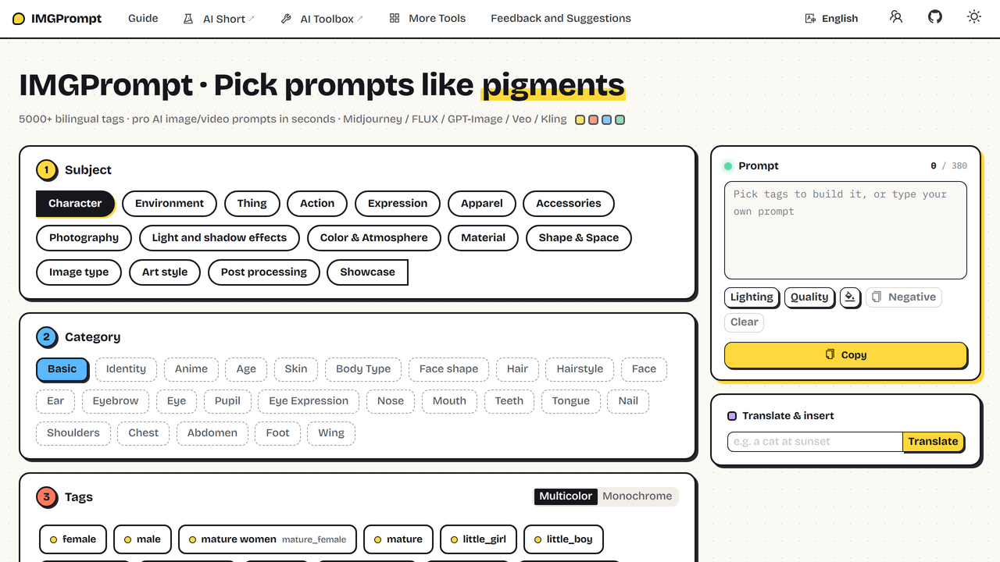

<h1 align="center">⚡️ IMGPrompt</h1>

<p align="center">
Click in your language, copy out the English wording AI image and video models expect.
</p>

<p align="center">
  <a href="https://github.com/rockbenben/img-prompt/releases"></a>
  <a href="https://github.com/rockbenben/img-prompt/blob/main/LICENSE"></a>
</p>

<p align="center">
  <a href="https://prompt.newzone.top/en"><b>▶ Try it online</b></a> ·
  <a href="https://github.com/rockbenben/img-prompt/releases/latest"><b>⬇ Desktop app</b></a> ·
  <a href="https://prompt.newzone.top/en/guide/deploy.html">Self-host guide</a> ·
  <a href="./README.zh.md">简体中文</a>
</p>



You know the look you are after — you just don't know that models call it `Tyndall effect`, `film grain` or `Fisheye Lens`. IMGPrompt is a prompt editor for AI art and video, built for people who don't think in English: it lays 5,000+ of those terms out by subject and category, labelled in your native language and nearly all carrying a preview image. Click the ones you want and the English prompt for GPT-Image-2, Midjourney, FLUX or Veo assembles on the right.

## Supported

| What | Details |
| --- | --- |
| **Target models** | GPT-Image-2 · Nano Banana · Midjourney · FLUX · Seedance · Veo · Kling — also compatible with Stable Diffusion and DALL·E syntax |
| **Languages** | 18, with the interface and the tag library both fully translated ([direct links below](#open-the-app-in-your-language)). Arabic renders right-to-left |
| **Run it in** | Any modern browser, nothing to install · Windows (exe / msi) · macOS (Intel + Apple Silicon) · Linux (deb / AppImage / rpm) |
| **Your data** | There is no backend — your selection lives in the URL and in your own browser, and never reaches a server of ours |
| **Built-in translation** | Google · Microsoft Edge · Youdao · MyMemory, tried in that order until one answers |

## Quick start

1. Open **[prompt.newzone.top/en](https://prompt.newzone.top/en)**, or install the [desktop app](https://github.com/rockbenben/img-prompt/releases/latest).
2. Pick a **subject** (①) → pick a **category** (②) → click the **tags** you want (③).
3. The English prompt assembles in the right-hand panel as you click. Hit **Copy** and paste it into your AI tool.

The filter you are viewing is written into the URL (`?object=Character&attribute=Basic`), so a bookmark or a shared link drops the next person on exactly the same view.

## Features

- **5,040 bilingual tags** across 16 subjects and 212 categories — lighting, composition, lenses, camera moves, art styles, materials, wardrobe — organised by hand, not scraped into one flat list.
- **A preview image on nearly every tag.** Hover to see what a style actually looks like; click it for a lightbox with zoom, rotate and download.
- **Type in any language and see the English.** The translate box works on free text, debounced 1.5s, and suggests curated tags that match what you typed.
- **Prompt housekeeping** — duplicate cleanup, one-tap negative-prompt template, inline lighting/quality snippets, random colour swap.
- **Multicolor or monochrome tags** — multicolor paints the grid in blocks of eight from a six-colour cycle, so your eye keeps its place in a long list. Plus light / dark / system theme; both choices persist and sync across tabs.
- **Open data.** The tag library is plain JSON in `src/app/data/prompt/prompt-<locale>.json` — fork it, extend it, ship your own.

## Open the app in your language

[English](https://prompt.newzone.top/en) · [中文](https://prompt.newzone.top/zh) · [繁體中文](https://prompt.newzone.top/zh-hant) · [日本語](https://prompt.newzone.top/ja) · [한국어](https://prompt.newzone.top/ko) · [Português](https://prompt.newzone.top/pt) · [Español](https://prompt.newzone.top/es) · [Français](https://prompt.newzone.top/fr) · [Deutsch](https://prompt.newzone.top/de) · [Italiano](https://prompt.newzone.top/it) · [Русский](https://prompt.newzone.top/ru) · [हिन्दी](https://prompt.newzone.top/hi) · [العربية](https://prompt.newzone.top/ar) · [বাংলা](https://prompt.newzone.top/bn) · [Indonesia](https://prompt.newzone.top/id) · [Türkçe](https://prompt.newzone.top/tr) · [Tiếng Việt](https://prompt.newzone.top/vi) · [ไทย](https://prompt.newzone.top/th)

## Limitations

- **The translate box uses free public endpoints** and no API key of yours. They rate-limit, and MyMemory refuses anything over 500 bytes — the app falls through the provider list, but a long paragraph can still come back untranslated.
- **Tag preview images are served from a CDN.** The tag data itself ships with the app, but the hover previews need a network connection, including in the desktop build.

## Development

Next.js 16 (App Router, React Compiler) + React 19 + TypeScript, Ant Design 6 and Tailwind CSS 4, with `next-intl` generating a static export per locale. Node `>=20.9.0`.

```bash
yarn install
yarn dev          # http://localhost:3000
yarn build        # static export into out/
yarn build:lang   # single-locale build (scripts/buildWithLang.js)
yarn lint
```

Full installation, deployment and Docker instructions live in the [deployment guide](https://prompt.newzone.top/en/guide/deploy.html).

Pull requests are welcome; for major changes, open an issue first to discuss direction. Prompt data contributions — adding or refining tags for a language — are especially appreciated, and the files are plain JSON with no tooling required.

## Credits and licensing

IMGPrompt's own code is [MIT](LICENSE). The prompt library is aggregated and curated from several open sources — huge thanks to:

- [EvoLinkAI/awesome-gpt-image-2-prompts](https://github.com/EvoLinkAI/awesome-gpt-image-2-prompts) — GPT-Image-2 prompt examples, licensed under [CC BY 4.0](https://creativecommons.org/licenses/by/4.0/). Entries are localized into 18 languages; per-entry author credits are preserved in the data file.
- [Physton/sd-webui-prompt-all-in-one](https://github.com/Physton/sd-webui-prompt-all-in-one) — baseline tag taxonomy (AGPL-3.0).
- [promptoMANIA](https://promptomania.com/midjourney-prompt-builder/) — structured keyword inspiration.
