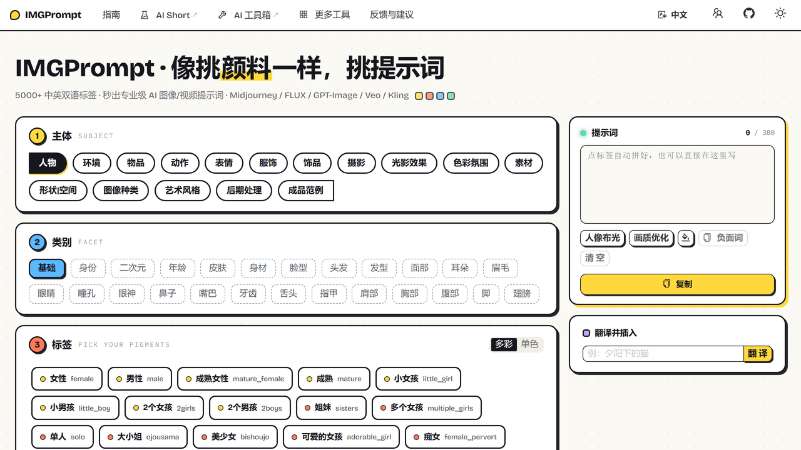

<h1 align="center">⚡️ IMGPrompt</h1>

<p align="center">
中文点标签，英文出提示词，AI 绘画/视频通用。
</p>

<p align="center">
  <a href="https://github.com/rockbenben/img-prompt/releases"></a>
  <a href="https://github.com/rockbenben/img-prompt/blob/main/LICENSE"></a>
</p>

<p align="center">
  <a href="https://prompt.newzone.top/zh"><b>▶ 在线体验</b></a> ·
  <a href="https://github.com/rockbenben/img-prompt/releases/latest"><b>⬇ 桌面客户端</b></a> ·
  <a href="https://prompt.newzone.top/zh/guide/deploy.html">自部署文档</a> ·
  <a href="./README.md">English</a>
</p>



你想要的是「丁达尔效应」「胶片颗粒」「鱼眼镜头」，模型认的却是 Tyndall effect、film grain、Fisheye Lens。IMGPrompt 是一款给非英语母语者做的提示词编辑器，把 5000 多组这样的对照按主体和类别铺成一面标签墙，几乎每条都配了示意图——点你要的，右侧实时拼出 GPT-Image-2、Midjourney、FLUX、Veo 认得的英文提示词。打开网页就能用。

## 支持范围

| 维度 | 支持情况 |
| --- | --- |
| **目标模型** | GPT-Image-2 · Nano Banana · Midjourney · FLUX · Seedance · Veo · Kling，同时兼容 Stable Diffusion、DALL·E 语法 |
| **语言** | 18 种，界面与提示词库全量翻译（[直达入口见下](#各语言直达入口)）。阿拉伯语自动右向左渲染 |
| **运行方式** | 浏览器免安装即用 · Windows · macOS（Intel + Apple Silicon） · Linux（deb / AppImage / rpm） |
| **数据去向** | 没有后端——你的选择只存在 URL 和你自己的浏览器里，不会经过我们的服务器 |
| **内置翻译** | Google · 微软 Edge · 有道 · MyMemory，按此顺序逐个降级，直到有一个返回结果 |

## 快速开始

1. 打开 **[prompt.newzone.top/zh](https://prompt.newzone.top/zh)**，或安装[桌面客户端](https://github.com/rockbenben/img-prompt/releases/latest)。
2. 选**主体**（①）→ 选**类别**（②）→ 点击你要的**标签**（③）。
3. 英文提示词会随点击实时拼进右侧面板，点**复制**，粘贴到 AI 工具即可。

当前的筛选条件会实时写进 URL（`?object=Character&attribute=Basic`），收藏或把链接发出去，对方打开就是同一个画面。

## 功能亮点

- **5040 条中英对照标签**，分布在 16 个主体、212 个类别下：光影效果、构图、镜头、运镜、艺术风格、材质、服饰——人工归类，不是一锅乱炖的平铺列表。
- **几乎每条标签都配示意图。** 悬停即可看到这个风格长什么样，点开进入 lightbox，可缩放、旋转、下载。
- **输入任意语言，直接看到英文。** 翻译框支持自由文本，防抖 1.5 秒，并会联想出匹配的规范标签。
- **提示词整理动作** —— 一键去重、一键复制负面提示词模板、内联的人像光照 / 画质模板、随机换色。
- **多彩 / 单色标签双模式** —— 多彩按每 8 个一块、6 色循环上色，长列表里眼睛不容易跑丢。外加浅色 / 深色 / 跟随系统主题，两项选择都会本地持久化并在多标签页间同步。
- **数据开放。** 词库就是 `src/app/data/prompt/prompt-<locale>.json` 里的标准 JSON，随便 fork、扩展、做成你自己的版本。

## 各语言直达入口

[中文](https://prompt.newzone.top/zh) · [繁體中文](https://prompt.newzone.top/zh-hant) · [English](https://prompt.newzone.top/en) · [日本語](https://prompt.newzone.top/ja) · [한국어](https://prompt.newzone.top/ko) · [Português](https://prompt.newzone.top/pt) · [Español](https://prompt.newzone.top/es) · [Français](https://prompt.newzone.top/fr) · [Deutsch](https://prompt.newzone.top/de) · [Italiano](https://prompt.newzone.top/it) · [Русский](https://prompt.newzone.top/ru) · [हिन्दी](https://prompt.newzone.top/hi) · [العربية](https://prompt.newzone.top/ar) · [বাংলা](https://prompt.newzone.top/bn) · [Indonesia](https://prompt.newzone.top/id) · [Türkçe](https://prompt.newzone.top/tr) · [Tiếng Việt](https://prompt.newzone.top/vi) · [ไทย](https://prompt.newzone.top/th)

## 已知限制

- **翻译走的是免费公共接口**，不需要你出 API Key，代价是会被限流；MyMemory 还硬性拒绝超过 500 字节的文本。应用会沿着服务列表逐个降级，但长段落仍有可能整段翻不出来。
- **标签示意图由 CDN 提供。** 标签数据本身随应用打包，但悬停预览图需要联网才能加载，桌面客户端同样如此。

## 本地开发与部署

Next.js 16（App Router + React Compiler）+ React 19 + TypeScript，Ant Design 6 与 Tailwind CSS 4，由 `next-intl` 按语种生成静态导出。Node 版本需要 `>=20.9.0`。

```bash
yarn install
yarn dev          # http://localhost:3000
yarn build        # 静态导出到 out/
yarn build:lang   # 单语种构建（scripts/buildWithLang.js）
yarn lint
```

完整的安装、部署与 Docker 说明见[部署文档](https://prompt.newzone.top/zh/guide/deploy.html)。

欢迎 PR，较大的改动建议先开 Issue 讨论方向。提示词数据相关的贡献尤其欢迎——文件都是标准 JSON，不需要额外工具链，直接改就行。

## 致谢与授权

IMGPrompt 自身代码采用 [MIT](LICENSE) 协议。提示词数据汇集并整理自多个开源项目，特别感谢：

- [EvoLinkAI/awesome-gpt-image-2-prompts](https://github.com/EvoLinkAI/awesome-gpt-image-2-prompts) —— GPT-Image-2 提示词示例，遵循 [CC BY 4.0](https://creativecommons.org/licenses/by/4.0/) 协议。条目已本地化至 18 种语言；每条原作者署名保留在数据文件中。
- [Physton/sd-webui-prompt-all-in-one](https://github.com/Physton/sd-webui-prompt-all-in-one) —— 基础标签分类体系（AGPL-3.0）。
- [promptoMANIA](https://promptomania.com/midjourney-prompt-builder/) —— 结构化关键词灵感来源。
